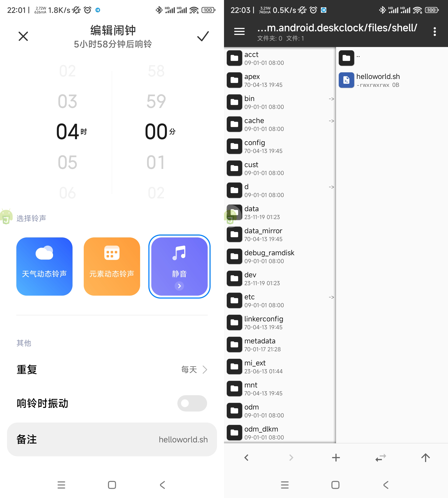
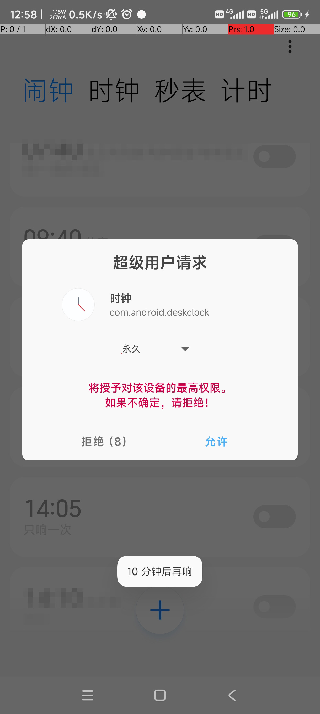

# 使用说明
## 原理
通过hook系统闹钟的AlarmAlertFullScreenActivity，在这个Activity启动时，根据你设置的闹钟配置来执行特定的Shell脚本。
## 可靠性
可靠性是开发此模块的缘由，试过很多定时任务的APP，可能因各种原因（如后台被杀）导致到点没有执行我下的任务。  
我想到系统里的闹钟，它可从来没有失误过，即使你把它的后台杀了，关机也能自动开机来提醒你。再想到LSPosed可以给APP添砖加瓦，所以就有了此模块，原理见上。  
应该仅支持MIUI，其他操作系统开可以试一试，要我适配你的系统可以发issues
## 使用与授予闹钟root权限
### 脚本存放目录
将Shell脚本放入`/data/user/0/com.android.deskclock/files/shell/`目录，如果没有`shell`文件夹，请自行创建一个。  
如果你想添加一个名为helloworld的Shell脚本，那么你应该放到这里：`/data/user/0/com.android.deskclock/files/shell/helloworld.sh`  
### 脚本文件与闹钟备注
新建一个脚本文件，假设你要创建的是"helloworld.sh"，创建完成后，再去新建一个备注与脚本文件名一样的闹钟，闹钟备注名就应该是"helloworld.sh"。闹钟应该铃声为无铃声且取消掉震动（如果你乐意也无所谓）。  

### 授予root权限
脚本文件一律使用ROOT执行！所以必须先授予闹钟ROOT权限！  
由于root的申请在闹钟响铃时执行，所以你第一次创建一个脚本后，把闹钟的时间设置在最近的几分钟后，响铃时会申请root权限，允许后就得到了root权限，后续新建其他脚本都无需授权（只要你不关闭或撤销magisk里的root授权即可），root权限申请成功后，就可以将闹钟的时间改为为你想要的时间，到点后即可正常执行你的脚本。
  
### 建议
执行脚本前，闹钟响铃的activity界面不会自动关闭，所以你应该添加一个滑动屏幕的命令，将闹铃关闭。当然我相信脚本你都会放在晚上你睡觉的时候让它执行，所以执行完关闭闹钟后，你应该再写一个解锁屏幕的命令，然后再去执行接下来的操作。  
**示例**
``` sh
sleep 3
#关闭闹钟
input swipe 500 1500 500 500
#解锁屏幕，视密码而定，下面的演示为没有密码的
sleep 3
input swipe 500 1500 500 500
sleep 1
#接下来要执行的操作
```
### 它会影响正常的闹钟吗？
只要你的闹钟备注没有对应的脚本文件，那么闹钟不会执行任何脚本，不影响正常使用。除非你故意在shell目录里放了个叫"起床"的脚本。